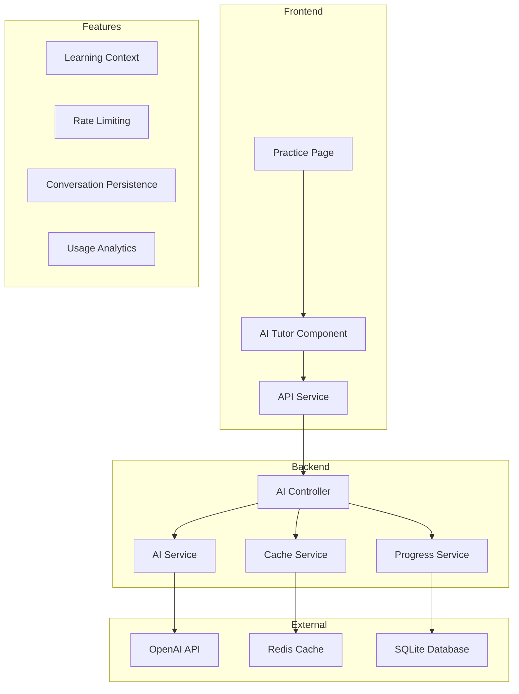

# Phase 3: AI Integration - Task Overview

## **Objective**
Implement a comprehensive AI-powered French tutor system with conversational learning, personalized guidance, and production-ready infrastructure.

## **Task Breakdown**

### **Core Implementation (MVP)**
| Task ID | Title | Estimated Time | Priority | Status |
|---------|-------|---------------|----------|---------|
| 3.1.A | [AI Service Infrastructure](./3-1-A-ai-infrastructure.md) | 2-3 hours | High | Not Started |
| 3.1.B | [Conversational Interface](./3-1-B-conversational-interface.md) | 3-4 hours | High | Not Started |
| 3.1.C | [Learning Context Integration](./3-1-C-learning-context-integration.md) | 1-2 hours | High | Not Started |
| 3.1.D | [Practice Page Integration](./3-1-D-practice-page-integration.md) | 2-3 hours | High | Not Started |

**Core MVP Total: 8-12 hours**

### **Production Enhancements**
| Task ID | Title | Estimated Time | Priority | Status |
|---------|-------|---------------|----------|---------|
| 3.1.E | [Production Caching & Rate Limiting](./3-1-E-production-caching-rate-limiting.md) | 4-6 hours | Medium | Not Started |
| 3.1.F | [Struggling Areas Detection](./3-1-F-struggling-areas-detection.md) | 2-3 hours | Medium | Not Started |
| 3.1.G | [Conversation Persistence](./3-1-G-conversation-persistence.md) | 3-4 hours | Medium | Not Started |
| 3.1.H | [Accessibility & UX Enhancements](./3-1-H-accessibility-ux-enhancements.md) | 3-4 hours | High | Not Started |

**Production Enhancement Total: 12-17 hours**

## **Implementation Strategy**

### **Phase 3.1: Core AI Tutor (Week 1)**
1. Complete tasks 3.1.A → 3.1.B → 3.1.C → 3.1.D in sequence
2. Each task should be completed and tested before moving to the next
3. Focus on MVP functionality with basic error handling
4. Use mock OpenAI responses initially, then integrate real API

### **Phase 3.2: Production Readiness (Week 2)**
1. Implement production caching and rate limiting (3.1.E)
2. Add accessibility features for compliance (3.1.H)
3. Enhance with conversation persistence (3.1.G)
4. Add intelligent struggling areas detection (3.1.F)

### **Phase 3.3: Polish & Testing (Week 3)**
1. Comprehensive testing across all features
2. Performance optimization and monitoring
3. User acceptance testing and feedback integration
4. Documentation updates and deployment preparation

## **Key Success Metrics**

### **Functional Requirements**
- [ ] Users can have natural conversations with AI tutor in French/English
- [ ] AI responses are contextually aware of user progress and level
- [ ] System handles 50+ concurrent users without performance degradation
- [ ] Rate limiting prevents API cost overruns
- [ ] Conversations persist across browser sessions

### **Non-Functional Requirements**
- [ ] AI response time < 3 seconds (95th percentile)
- [ ] WCAG 2.1 AA accessibility compliance
- [ ] Mobile-responsive design works on iOS and Android
- [ ] OpenAI API costs stay within $100/month budget
- [ ] System recovers gracefully from API failures

## **Architecture Overview**

## **Dependencies**

### **External Dependencies**
- OpenAI API key and billing setup
- Redis server for production caching
- Database migrations for conversation storage
- Design tokens and theme system from Phase 1/2

### **Internal Dependencies**
- Existing authentication system
- Progress tracking from Phase 2
- Learning path system
- User role and permission system

## **Risk Mitigation**

### **Technical Risks**
- **API Cost Overrun**: Implemented in 3.1.A and enhanced in 3.1.E
- **Performance Issues**: Addressed through caching and optimization
- **Accessibility Compliance**: Dedicated task 3.1.H for WCAG compliance

### **User Experience Risks**
- **Poor AI Responses**: Context integration and progressive enhancement
- **Slow Response Times**: Caching and fallback mechanisms
- **Conversation Loss**: Persistence system in 3.1.G

## **Future Enhancements**
See [Future Implementation Considerations](../future_implementation_considerations.md) for advanced features:
- Semantic response caching
- Conversation analytics and insights
- Advanced rate limiting and cost control
- Multi-language AI tutor support

---

**Total Phase 3 Estimated Time: 20-29 hours**
**Target Completion: 3-4 weeks with testing and polish**
