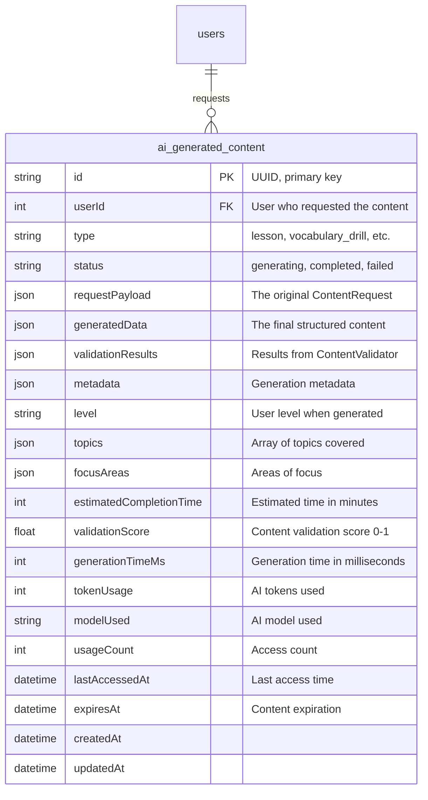

# Task 3.1.B.2: Database Schema for AI Content

## **Task Information**
- **Task ID**: 3.1.B.2
- **Parent Task**: 3.1.B (Dynamic Content Generation)
- **Estimated Time**: 0.5 hours
- **Priority**: ⚡ High
- **Dependencies**: Task 3.1.B.1 (Initial Scaffolding & Type Definition)
- **Status**: ⏳ Not Started

## **Objective**
Create database schema and migration for storing AI-generated content. The new table will complement the existing static content system while providing flexible storage for dynamic, AI-generated educational materials.

## **Success Criteria**
- [ ] New `ai_generated_content` table created with proper indexes
- [ ] Migration script tested and validated
- [ ] Database schema documentation updated
- [ ] Proper foreign key relationships established
- [ ] Performance considerations addressed with appropriate indexes

## **Implementation Details**

### **1. Database Migration**

Create a new migration for the AI-generated content table that stores flexible, structured content.

```typescript
// database/migrations/20250107000000_create_ai_generated_content_table.ts

import { Knex } from 'knex';

export async function up(knex: Knex): Promise<void> {
  await knex.schema.createTable('ai_generated_content', (table) => {
    // Primary key using UUID for better distribution
    table.string('id', 36).primary().notNullable();
    
    // User association
    table.integer('userId').notNullable().references('id').inTable('users').onDelete('CASCADE');
    
    // Content classification
    table.enum('type', [
      'lesson',
      'vocabulary_drill', 
      'grammar_exercise',
      'cultural_content',
      'personalized_exercise',
      'pronunciation_drill',
      'conversation_practice'
    ]).notNullable();
    
    // Generation status
    table.enum('status', [
      'pending',
      'generating', 
      'completed',
      'failed',
      'cached'
    ]).notNullable().defaultTo('pending');
    
    // Content data - flexible JSON storage
    table.json('requestPayload').notNullable().comment('Original ContentRequest data');
    table.json('generatedData').nullable().comment('Final structured content');
    table.json('validationResults').nullable().comment('Results from ContentValidator');
    table.json('metadata').nullable().comment('Generation metadata (timing, model, etc.)');
    
    // Learning context
    table.string('level', 10).nullable().comment('User level when content was generated');
    table.json('topics').nullable().comment('Array of topics covered');
    table.json('focusAreas').nullable().comment('Areas of focus for personalization');
    
    // Performance and caching
    table.integer('estimatedCompletionTime').nullable().comment('Estimated time in minutes');
    table.float('validationScore').nullable().comment('Content validation score 0-1');
    table.integer('generationTimeMs').nullable().comment('Time taken to generate in milliseconds');
    table.integer('tokenUsage').nullable().comment('AI tokens used for generation');
    table.string('modelUsed', 50).nullable().comment('AI model used for generation');
    
    // Usage tracking
    table.integer('usageCount').defaultTo(0).comment('How many times this content was accessed');
    table.datetime('lastAccessedAt').nullable().comment('When content was last accessed');
    table.datetime('expiresAt').nullable().comment('When cached content expires');
    
    // Audit fields
    table.datetime('createdAt').defaultTo(knex.fn.now()).notNullable();
    table.datetime('updatedAt').defaultTo(knex.fn.now()).notNullable();
    
    // Indexes for performance
    table.index(['userId', 'type'], 'idx_ai_content_user_type');
    table.index(['status'], 'idx_ai_content_status');
    table.index(['type', 'level'], 'idx_ai_content_type_level');
    table.index(['createdAt'], 'idx_ai_content_created');
    table.index(['expiresAt'], 'idx_ai_content_expires');
    table.index(['usageCount'], 'idx_ai_content_usage');
    
    // Composite index for cache lookups
    table.index(['userId', 'type', 'level', 'status'], 'idx_ai_content_cache_lookup');
  });

  // Add trigger to update updatedAt timestamp
  await knex.raw(`
    CREATE OR REPLACE FUNCTION update_updated_at_column()
    RETURNS TRIGGER AS $$
    BEGIN
        NEW."updatedAt" = CURRENT_TIMESTAMP;
        RETURN NEW;
    END;
    $$ language 'plpgsql';
  `);

  await knex.raw(`
    CREATE TRIGGER update_ai_generated_content_updated_at 
    BEFORE UPDATE ON ai_generated_content 
    FOR EACH ROW EXECUTE FUNCTION update_updated_at_column();
  `);
}

export async function down(knex: Knex): Promise<void> {
  await knex.raw('DROP TRIGGER IF EXISTS update_ai_generated_content_updated_at ON ai_generated_content;');
  await knex.raw('DROP FUNCTION IF EXISTS update_updated_at_column();');
  await knex.schema.dropTableIfExists('ai_generated_content');
}
```

### **2. Database Model**

Create a Knex model for the new table following existing patterns.

```typescript
// server/src/models/AIGeneratedContent.ts

import { Model } from 'objection';
import { User } from './User';

export interface AIGeneratedContentData {
  id: string;
  userId: number;
  type: 'lesson' | 'vocabulary_drill' | 'grammar_exercise' | 'cultural_content' | 'personalized_exercise' | 'pronunciation_drill' | 'conversation_practice';
  status: 'pending' | 'generating' | 'completed' | 'failed' | 'cached';
  requestPayload: any;
  generatedData?: any;
  validationResults?: any;
  metadata?: any;
  level?: string;
  topics?: string[];
  focusAreas?: string[];
  estimatedCompletionTime?: number;
  validationScore?: number;
  generationTimeMs?: number;
  tokenUsage?: number;
  modelUsed?: string;
  usageCount: number;
  lastAccessedAt?: Date;
  expiresAt?: Date;
  createdAt: Date;
  updatedAt: Date;
}

export class AIGeneratedContent extends Model implements AIGeneratedContentData {
  static tableName = 'ai_generated_content';

  // Properties
  id!: string;
  userId!: number;
  type!: 'lesson' | 'vocabulary_drill' | 'grammar_exercise' | 'cultural_content' | 'personalized_exercise' | 'pronunciation_drill' | 'conversation_practice';
  status!: 'pending' | 'generating' | 'completed' | 'failed' | 'cached';
  requestPayload!: any;
  generatedData?: any;
  validationResults?: any;
  metadata?: any;
  level?: string;
  topics?: string[];
  focusAreas?: string[];
  estimatedCompletionTime?: number;
  validationScore?: number;
  generationTimeMs?: number;
  tokenUsage?: number;
  modelUsed?: string;
  usageCount!: number;
  lastAccessedAt?: Date;
  expiresAt?: Date;
  createdAt!: Date;
  updatedAt!: Date;

  // Relationships
  static relationMappings = {
    user: {
      relation: Model.BelongsToOneRelation,
      modelClass: User,
      join: {
        from: 'ai_generated_content.userId',
        to: 'users.id'
      }
    }
  };

  // JSON schema for validation
  static jsonSchema = {
    type: 'object',
    required: ['id', 'userId', 'type', 'status', 'requestPayload'],
    properties: {
      id: { type: 'string', maxLength: 36 },
      userId: { type: 'integer' },
      type: { 
        type: 'string', 
        enum: ['lesson', 'vocabulary_drill', 'grammar_exercise', 'cultural_content', 'personalized_exercise', 'pronunciation_drill', 'conversation_practice']
      },
      status: { 
        type: 'string', 
        enum: ['pending', 'generating', 'completed', 'failed', 'cached']
      },
      requestPayload: { type: 'object' },
      generatedData: { type: ['object', 'null'] },
      validationResults: { type: ['object', 'null'] },
      metadata: { type: ['object', 'null'] },
      level: { type: ['string', 'null'], maxLength: 10 },
      topics: { type: ['array', 'null'] },
      focusAreas: { type: ['array', 'null'] },
      estimatedCompletionTime: { type: ['integer', 'null'], minimum: 0 },
      validationScore: { type: ['number', 'null'], minimum: 0, maximum: 1 },
      generationTimeMs: { type: ['integer', 'null'], minimum: 0 },
      tokenUsage: { type: ['integer', 'null'], minimum: 0 },
      modelUsed: { type: ['string', 'null'], maxLength: 50 },
      usageCount: { type: 'integer', minimum: 0, default: 0 },
      lastAccessedAt: { type: ['string', 'null'], format: 'date-time' },
      expiresAt: { type: ['string', 'null'], format: 'date-time' }
    }
  };

  // Hooks
  $beforeInsert() {
    this.createdAt = new Date();
    this.updatedAt = new Date();
    if (!this.usageCount) {
      this.usageCount = 0;
    }
  }

  $beforeUpdate() {
    this.updatedAt = new Date();
  }

  // Helper methods
  isExpired(): boolean {
    return this.expiresAt ? new Date() > this.expiresAt : false;
  }

  markAccessed(): void {
    this.lastAccessedAt = new Date();
    this.usageCount += 1;
  }

  isReusable(): boolean {
    return this.status === 'completed' && !this.isExpired();
  }

  // Static methods for common queries
  static findByUserAndType(userId: number, type: string) {
    return this.query()
      .where('userId', userId)
      .where('type', type)
      .orderBy('createdAt', 'desc');
  }

  static findReusableContent(userId: number, type: string, level?: string) {
    let query = this.query()
      .where('userId', userId)
      .where('type', type)
      .where('status', 'completed')
      .where(function() {
        this.whereNull('expiresAt').orWhere('expiresAt', '>', new Date());
      });

    if (level) {
      query = query.where('level', level);
    }

    return query.orderBy('usageCount', 'asc').orderBy('createdAt', 'desc');
  }

  static cleanup() {
    return this.query()
      .delete()
      .where('expiresAt', '<', new Date())
      .orWhere(function() {
        this.where('status', 'failed')
          .where('createdAt', '<', new Date(Date.now() - 24 * 60 * 60 * 1000)); // 24 hours ago
      });
  }
}
```

### **3. Integration with Existing Schema**

Update the database schema documentation to reflect the new table.



## **Files to Create**
```
database/migrations/20250107000000_create_ai_generated_content_table.ts
server/src/models/AIGeneratedContent.ts
```

## **Files to Modify**
```
docs/development_docs/architecture/database_schema.mermaid (add new table)
```

## **Dependencies**
- Task 3.1.B.1 for TypeScript interface definitions
- Existing user table and migration patterns
- Knex and Objection.js ORM setup

## **Review Points**
1. **Performance**: Verify indexes are appropriate for expected query patterns
2. **Storage**: Confirm JSON fields are properly structured for the expected data
3. **Relationships**: Validate foreign key constraints and cascade rules
4. **Migration Safety**: Ensure migration can be rolled back safely

## **Possible Issues & Solutions**
1. **Issue**: JSON storage might become large
   - **Solution**: Implement content compression or separate large fields
2. **Issue**: Index overhead on frequently updated table
   - **Solution**: Monitor and optimize indexes based on actual usage patterns
3. **Issue**: Migration conflicts with existing data
   - **Solution**: Ensure migration is isolated and doesn't affect existing content

## **Testing Strategy**
- Migration up/down testing in isolated environment
- Model validation testing with various data scenarios
- Index performance testing with sample data
- Foreign key constraint testing

## **Performance Considerations**
- **Caching Strategy**: Use `expiresAt` and `usageCount` for intelligent caching
- **Cleanup Jobs**: Implement regular cleanup of expired/failed content
- **Query Optimization**: Index on common query patterns (user + type + level)
- **Storage Optimization**: Consider compression for large JSON fields

## **Next Steps**
After completion, proceed to Task 3.1.B.3 (Implement Core Generation Logic)
