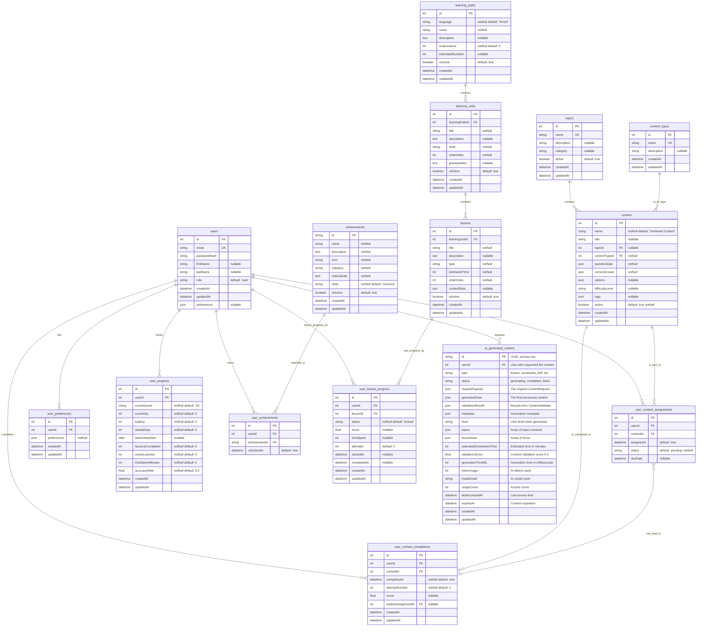
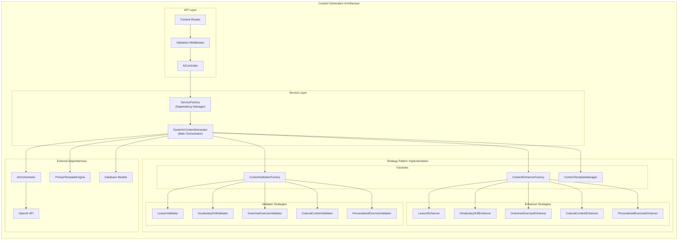

# Task 3.1.B.6: Update Architecture Documentation

## **Task Information**
- **Task ID**: 3.1.B.6
- **Parent Task**: 3.1.B (Dynamic Content Generation)
- **Estimated Time**: 0.5 hours
- **Priority**: ⚡ High
- **Dependencies**: Task 3.1.B.5 (API Layer Integration)
- **Status**: ⏳ Not Started

## **Objective**
Update all architectural documentation to reflect the new Dynamic Content Generation system, including system architecture diagrams, database schema updates, and integration documentation.

## **Success Criteria**
- [ ] System architecture diagram updated with new content generation services
- [ ] Database schema documentation includes AI content table
- [ ] API documentation reflects new content generation endpoints
- [ ] Service dependency diagram updated
- [ ] Integration patterns documented
- [ ] Performance considerations documented

## **Implementation Details**

### **1. Update System Architecture Diagram**

Update the main system architecture Mermaid diagram to include the new content generation services.

```mermaid
graph TD
    subgraph "Frontend (React + TypeScript)"
        direction TB

        subgraph "State & API Management"
            AuthContext["AuthContext (User, Token, Auth Status)"]
            ApiService["Central API Service (Axios with Interceptors)"]
            useLearningPath["useLearningPath Hook (State for Lessons)"]
            AuthContext --> ApiService
            ApiService --> AuthContext
        end

        subgraph "Core App Screens (Mobile First)"
            direction LR
            HomePage(Home)
            LessonsPage(Lessons)
            PracticePage(Practice)
            ProgressPage(Progress)
            ProfilePage(Profile)
        end

        subgraph "UI Components"
            MainLayout["MainLayout (Mobile Frame)"]
            BottomNav["BottomTabNavigation"]
            LearningPath["LearningPath.tsx"]
            LearningUnit["LearningUnit.tsx"]
            LessonNode["LessonNode.tsx"]
            
            subgraph "Dynamic Lesson Content"
                direction TB
                LessonPage["LessonPage.tsx (Controller)"]
                DynamicContent["DynamicLessonContent.tsx"]
                Suspense["React.Suspense (Loading Boundary)"]
                VocabularyLesson["VocabularyLesson.tsx"]
                GrammarLesson["GrammarLesson.tsx"]
                ConversationLesson["ConversationLesson.tsx"]
                
                LessonPage --> DynamicContent
                DynamicContent --> Suspense
                Suspense --> VocabularyLesson
                Suspense --> GrammarLesson
                Suspense --> ConversationLesson
            end
        end

        MainLayout --> BottomNav
        MainLayout --> HomePage
        MainLayout --> LessonsPage
        MainLayout --> PracticePage
        MainLayout --> ProgressPage
        MainLayout --> ProfilePage
        
        LessonsPage --> LearningPath
        LearningPath --> LearningUnit
        LearningUnit --> LessonNode
        
        AuthContext -- "Provides auth state" --> MainLayout
        useLearningPath -- "Fetches data via" --> ApiService
        LessonNode -- "Navigates to" --> LessonPage
    end

    subgraph "Backend API (Node.js + Express)"
        direction TB

        ApiGateway["/api/v1"]

        subgraph "Routes"
            UserRoutes["user.routes.ts"]
            LearningRoutes["learning.routes.ts"]
            MetaRoutes["meta.routes.ts"]
            AuthRoutes["auth.routes.ts"]
            AdminRoutes["admin.routes.ts"]
            AIRoutes["ai.routes.ts"]
        end

        subgraph "Controllers"
            UserController["user.controller.ts"]
            ProgressController["progress.controller.ts"]
            GamificationController["gamification.controller.ts"]
            LearningPathController["learningPath.controller.ts"]
            AIController["ai.controller.ts"]
            SpeechController["speech.controller.ts"]
        end

        subgraph "Services"
            ProgressService["progress.service.ts"]
            LearningPathService["learningPath.service.ts"]
            GamificationService["gamification.service.ts (placeholder)"]
            SpeechService["speech.service.ts (placeholder)"]
        end

        subgraph "AI Services Layer"
            direction TB
            AIOrchestrator["AIOrchestrator"]

            subgraph "Content Generation Engine"
                direction TB
                DynamicContentGenerator["DynamicContentGenerator"]
                
                subgraph "Strategy Pattern Services"
                    direction LR
                    ContentValidatorFactory["ContentValidatorFactory"]
                    ContentEnhancerFactory["ContentEnhancerFactory"]
                    ContentTemplateManager["ContentTemplateManager"]
                end

                subgraph "Content Validators"
                    direction LR
                    LessonValidator["LessonValidator"]
                    VocabularyValidator["VocabularyDrillValidator"]
                    GrammarValidator["GrammarExerciseValidator"]
                    CulturalValidator["CulturalContentValidator"]
                end

                subgraph "Content Enhancers"
                    direction LR
                    LessonEnhancer["LessonEnhancer"]
                    VocabularyEnhancer["VocabularyDrillEnhancer"]
                    GrammarEnhancer["GrammarExerciseEnhancer"]
                    CulturalEnhancer["CulturalContentEnhancer"]
                end
            end
            
            subgraph "Supporting AI Services"
                direction LR
                CacheService["CacheService"]
                RateLimitService["RateLimitService"]
                FallbackHandler["FallbackHandler"]
                ContextService["ContextService"]
                AIMetricsService["AIMetricsService"]
                PromptTemplateEngine["PromptTemplateEngine"]
            end
            
            AIController --> AIOrchestrator
            AIController --> DynamicContentGenerator
            AIOrchestrator --> CacheService
            AIOrchestrator --> RateLimitService
            AIOrchestrator --> FallbackHandler
            AIOrchestrator --> ContextService
            
            DynamicContentGenerator --> AIOrchestrator
            DynamicContentGenerator --> ContentValidatorFactory
            DynamicContentGenerator --> ContentEnhancerFactory
            DynamicContentGenerator --> ContentTemplateManager
            DynamicContentGenerator --> PromptTemplateEngine
            
            ContentValidatorFactory --> LessonValidator
            ContentValidatorFactory --> VocabularyValidator
            ContentValidatorFactory --> GrammarValidator
            ContentValidatorFactory --> CulturalValidator
            
            ContentEnhancerFactory --> LessonEnhancer
            ContentEnhancerFactory --> VocabularyEnhancer
            ContentEnhancerFactory --> GrammarEnhancer
            ContentEnhancerFactory --> CulturalEnhancer
        end
        
        ApiGateway --> AuthRoutes
        ApiGateway --> UserRoutes
        ApiGateway --> LearningRoutes
        ApiGateway --> MetaRoutes
        ApiGateway --> AdminRoutes
        ApiGateway --> AIRoutes

        UserRoutes --> UserController
        UserRoutes --> ProgressController
        UserRoutes --> GamificationController
        
        LearningRoutes --> LearningPathController
        LearningRoutes --> AIController
        LearningRoutes --> SpeechController

        AIRoutes --> AIController

        MetaRoutes --> GamificationController

        ProgressController --> ProgressService
        GamificationController --> GamificationService
        LearningPathController --> LearningPathService
        SpeechController --> SpeechService
    end

    subgraph "Data & External Services"
        direction TB
        Database["Database (Postgres + Knex)"]
        Redis["Redis (Caching, Rate Limiting)"]
        OpenAI["OpenAI API"]
        
        CacheService --> Redis
        RateLimitService --> Redis
        ContextService --> Database
        AIOrchestrator --> OpenAI
        DynamicContentGenerator --> Database
    end

    subgraph "External Services & Deployment"
        GitHub["GitHub Repository"]
        Vercel["Vercel Hosting"]
        AI_Tutor["AI Tutor Service (Future)"]
        
        GitHub -- "CI/CD" --> Vercel
        Vercel -- "Serves" --> Frontend
    end

    ApiService -- "Makes calls to" --> ApiGateway
```



### **2. Update Database Schema Documentation**

Update the database schema diagram to include the new AI-generated content table.



### **3. Service Dependency Documentation**

Create a detailed service dependency diagram showing the Strategy Pattern implementation.



### **4. API Endpoint Documentation**

Create comprehensive API documentation for the new content generation endpoints.

```yaml
# Content Generation API Endpoints

/api/ai/content/generate:
  POST:
    summary: Generate dynamic content based on detailed request
    authentication: Required (Bearer token)
    request_body:
      type: ContentRequest
      properties:
        type: [lesson, vocabulary_drill, grammar_exercise, cultural_content, personalized_exercise]
        level: [A1, A2, B1, B2, C1, C2]
        topics: string[]
        duration: number (1-60 minutes)
        focusAreas: string[]
        learningStyle: [visual, auditory, kinesthetic, mixed]
    response:
      success: GeneratedContent object
      error: Validation errors or generation failure

/api/ai/content/lesson:
  POST:
    summary: Generate a structured French lesson
    authentication: Required
    specialized_for: Interactive lessons with sections and exercises
    
/api/ai/content/vocabulary-drill:
  POST:
    summary: Generate vocabulary practice exercises
    authentication: Required
    specialized_for: Vocabulary learning with examples and exercises

/api/ai/content/grammar-exercise:
  POST:
    summary: Generate grammar-focused exercises
    authentication: Required
    specialized_for: Grammar rules, explanations, and practice

/api/ai/content/cultural:
  POST:
    summary: Generate French cultural content
    authentication: Required
    specialized_for: Cultural insights with language context

/api/ai/content/personalized-exercise:
  POST:
    summary: Generate exercises targeting user weaknesses
    authentication: Required
    specialized_for: Adaptive content based on user progress

/api/ai/content/history:
  GET:
    summary: Retrieve user's content generation history
    authentication: Required
    pagination: Supports page and limit parameters
    filtering: Optional type parameter
```

### **5. Integration Patterns Documentation**

Document the key integration patterns used in the content generation system.

```markdown
# Content Generation Integration Patterns

## 1. Strategy Pattern for Content Processing

The system uses the Strategy Pattern to handle different content types:

- **ContentValidatorFactory**: Selects appropriate validator based on content type
- **ContentEnhancerFactory**: Selects appropriate enhancer based on content type
- **Dynamic Selection**: Runtime selection based on ContentType enum

Benefits:
- Easy to add new content types
- Type-specific logic encapsulation
- Testable individual strategies

## 2. Factory Pattern for Service Management

ServiceFactory manages complex service dependencies:

- **Singleton Instance**: Ensures single instance of expensive services
- **Lazy Initialization**: Services created only when needed
- **Dependency Injection**: Clean separation of concerns

## 3. Template Method Pattern for Content Structure

Content structuring follows template method pattern:
- Base generation workflow in DynamicContentGenerator
- Type-specific structure methods for each content type
- Consistent processing pipeline

## 4. Fallback Pattern for Reliability

Multiple fallback mechanisms ensure reliability:
- AI service failure → Static content templates
- Validation failure → Retry with adjusted parameters
- Performance degradation → Cached content

## 5. Adapter Pattern for External Services

Clean integration with external services:
- AIOrchestrator adapts OpenAI API
- PromptTemplateEngine adapts prompt generation
- Content validators adapt different validation rules
```

### **6. Performance Considerations Documentation**

```markdown
# Performance Considerations for Content Generation

## Database Optimization
- Indexes on ai_generated_content table for fast lookups
- Composite index for cache queries (userId, type, level, status)
- JSON field optimization for large content objects

## Caching Strategy
- User context caching to avoid repeated database queries
- Generated content caching based on similarity
- Template caching for faster content structuring

## AI API Optimization
- Token usage optimization per content type
- Temperature settings for consistency vs creativity balance
- Rate limiting to prevent cost overruns

## Memory Management
- Lazy loading of user context data
- Streaming for large content responses
- Garbage collection optimization for long-running processes

## Scalability Considerations
- Stateless service design for horizontal scaling
- Database connection pooling
- Async processing for non-blocking content generation
```

## **Files to Modify**
```
docs/development_docs/architecture/system_architecture.mermaid (comprehensive update)
docs/development_docs/architecture/database_schema.mermaid (add AI content table)
```

## **Files to Create**
```
docs/development_docs/architecture/content-generation-services.mermaid (new diagram)
docs/development_docs/architecture/integration-patterns.md (new documentation)
docs/development_docs/architecture/performance-considerations.md (new documentation)
docs/api/content-generation-endpoints.yaml (comprehensive API docs)
```

## **Dependencies**
- Task 3.1.B.5 (API Layer Integration) - needs API endpoints defined
- All previous subtasks for complete understanding of the system

## **Review Points**
1. **Accuracy**: Verify all diagrams reflect actual implementation
2. **Completeness**: Ensure all new services and relationships are documented
3. **Clarity**: Confirm diagrams are easy to understand for new developers
4. **Consistency**: Check that documentation style matches existing patterns

## **Testing Strategy**
- Validate Mermaid diagrams render correctly
- Review documentation for technical accuracy
- Verify API documentation matches implementation
- Test integration pattern examples

## **Next Steps**
This completes Task 3.1.B (Dynamic Content Generation). The next task in the sequence is Task 3.1.C (AI Assessment & Grading Engine).
