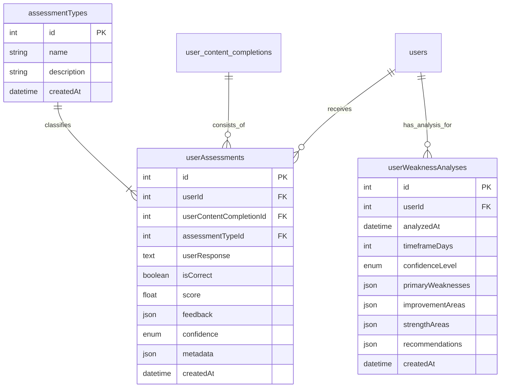

# Task 3.1.C.1: DB Schema & Migrations for Assessments

## **Task Information**
- **Parent Task**: 3.1.C - AI Assessment & Grading Engine
- **Task ID**: 3.1.C.1
- **Estimated Time**: 0.75 hours
- **Priority**: 🔥 Critical
- **Dependencies**: None

## **Objective**
Create a robust and normalized database schema to store detailed assessment results and periodic weakness analysis reports, adhering to the project's `camelCase` naming convention.

## **Success Criteria**
- [ ] A Knex migration file is created for the new tables.
- [ ] The migration successfully creates `assessmentTypes`, `userAssessments`, and `userWeaknessAnalyses` tables.
- [ ] Foreign key constraints are correctly established and indexed.
- [ ] The `database_schema.mermaid` diagram is updated to reflect the new tables and relationships.
- [ ] The new `assessmentTypes` table is seeded with initial data.

## **Implementation Details**

### **1. New Database Tables**

Three new tables are required, following the `camelCase` convention.

#### **a. `assessmentTypes`**
This new table provides a single source of truth for all possible assessment categories.

-   **`id`**: Primary Key
-   **`name`**: String (e.g., 'open-ended', 'fill-in-blank'). Unique.
-   **`description`**: Text field for an internal description of the assessment type.
-   **`createdAt`**: Timestamp.

#### **b. `userAssessments`**
This table stores the result of every single assessment attempt.

-   **`id`**: Primary Key
-   **`userId`**: Foreign Key to `users.id`. Indexed.
-   **`userContentCompletionId`**: Foreign Key to `user_content_completions.id`. Indexed.
-   **`assessmentTypeId`**: Foreign Key to `assessmentTypes.id`.
-   **`userResponse`**: Text field to store the user's answer.
-   **`isCorrect`**: Boolean.
-   **`score`**: Float (0-100).
-   **`feedback`**: JSONB.
-   **`confidence`**: ENUM ('low', 'medium', 'high').
-   **`metadata`**: JSONB.
-   **`createdAt`**: Timestamp.

#### **c. `userWeaknessAnalyses`**
This table stores the output of the periodic, asynchronous weakness analysis job.

-   **`id`**: Primary Key
-   **`userId`**: Foreign Key to `users.id`. Indexed.
-   **`analyzedAt`**: Timestamp.
-   **`timeframeDays`**: Integer.
-   **`confidenceLevel`**: ENUM ('low', 'medium', 'high').
-   **`primaryWeaknesses`**: JSONB.
-   **`improvementAreas`**: JSONB.
-   **`strengthAreas`**: JSONB.
-   **`recommendations`**: JSONB.
-   **`createdAt`**: Timestamp.

### **2. Knex Migration Script**

A new migration file will be created to apply these schema changes.

```typescript
// database/migrations/YYYYMMDDHHMMSS_create_assessment_tables.ts
import { Knex } from 'knex';

const CONFIDENCE_LEVELS = ['low', 'medium', 'high'];
const ASSESSMENT_TYPE_NAMES = ['open-ended', 'fill-in-blank', 'multiple-choice', 'speech-pronunciation'];

export async function up(knex: Knex): Promise<void> {
  // 1. Create the lookup table for assessment types.
  await knex.schema.createTable('assessmentTypes', (table) => {
    table.increments('id').primary();
    table.string('name').notNullable().unique();
    table.text('description');
    table.timestamp('createdAt').defaultTo(knex.fn.now());
  });

  // 2. Seed the assessment_types table with initial values.
  await knex('assessmentTypes').insert(
    ASSESSMENT_TYPE_NAMES.map(name => ({ name, description: `Assessment type for ${name} questions.` }))
  );

  // 3. Create the user_assessments table with a foreign key.
  await knex.schema.createTable('userAssessments', (table) => {
    table.increments('id').primary();
    table.integer('userId').unsigned().notNullable().references('id').inTable('users').onDelete('CASCADE');
    table.integer('userContentCompletionId').unsigned().notNullable().references('id').inTable('user_content_completions').onDelete('CASCADE');
    table.integer('assessmentTypeId').unsigned().references('id').inTable('assessmentTypes').onDelete('SET NULL');
    table.text('userResponse');
    table.boolean('isCorrect').notNullable();
    table.float('score').notNullable();
    table.jsonb('feedback').notNullable();
    table.enum('confidence', CONFIDENCE_LEVELS).notNullable();
    table.jsonb('metadata');
    table.timestamp('createdAt').defaultTo(knex.fn.now());

    table.index('userId');
    table.index('userContentCompletionId');
    table.index('assessmentTypeId');
  });

  // 4. Create the weakness analysis table.
  await knex.schema.createTable('userWeaknessAnalyses', (table) => {
    table.increments('id').primary();
    table.integer('userId').unsigned().notNullable().references('id').inTable('users').onDelete('CASCADE');
    table.timestamp('analyzedAt').defaultTo(knex.fn.now());
    table.integer('timeframeDays').notNullable();
    table.enum('confidenceLevel', CONFIDENCE_LEVELS).notNullable();
    table.jsonb('primaryWeaknesses');
    table.jsonb('improvementAreas');
    table.jsonb('strengthAreas');
    table.jsonb('recommendations');
    table.timestamp('createdAt').defaultTo(knex.fn.now());

    table.index('userId');
  });
}

export async function down(knex: Knex): Promise<void> {
  await knex.schema.dropTableIfExists('userWeaknessAnalyses');
  await knex.schema.dropTableIfExists('userAssessments');
  await knex.schema.dropTableIfExists('assessmentTypes');
}
```

### **3. Architecture Document Updates**

-   **File to Modify**: `docs/development_docs/architecture/database_schema.mermaid`
-   **Change**: Add the new tables and their relationships to the ERD diagram.



## **Review Points & Solutions**

-   **🔍 Review Point: Data Integrity & Naming Convention**
    -   **Concern**: Using simple strings for categorical data can lead to inconsistencies. Naming should be consistent.
    -   **Solution**: We have normalized `assessmentType` into its own lookup table, `assessmentTypes`, and updated all new table names to `camelCase` to align with project standards. This enforces data integrity and consistency.
-   **🔍 Review Point: Data Volume**
    -   **Concern**: The `userAssessments` table could grow very large.
    -   **Solution**: This is intentional for detailed analytics. We have added explicit indexes on all foreign keys to ensure high query performance.
