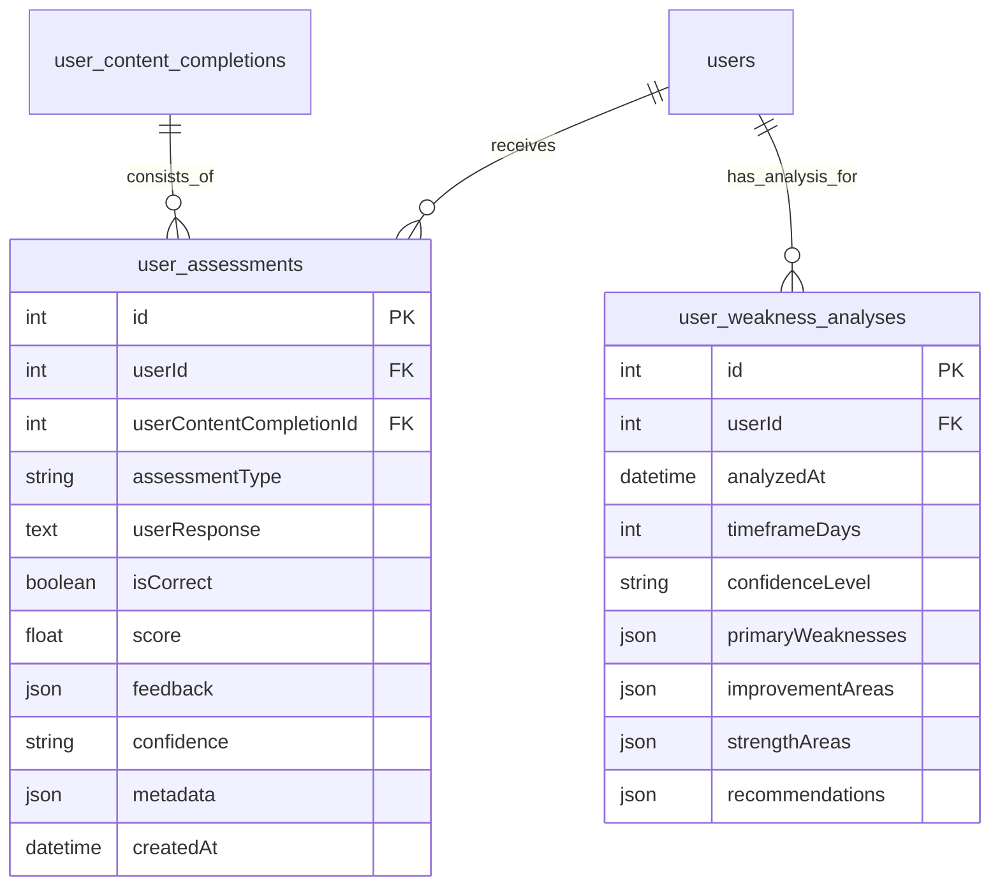

# Task 3.1.C.1: DB Schema & Migrations for Assessments

## **Task Information**
- **Parent Task**: 3.1.C - AI Assessment & Grading Engine
- **Task ID**: 3.1.C.1
- **Estimated Time**: 0.5 hours
- **Priority**: 🔥 Critical
- **Dependencies**: None

## **Objective**
Create the necessary database schema to store detailed assessment results and periodic weakness analysis reports. This provides the data foundation for all grading, feedback, and long-term analytics features.

## **Success Criteria**
- [ ] A Knex migration file is created for the new tables.
- [ ] The migration successfully creates `user_assessments` and `user_weakness_analyses` tables.
- [ ] Foreign key constraints are correctly established to link data to users and content.
- [ ] The `database_schema.mermaid` diagram is updated to reflect the new tables and relationships.

## **Implementation Details**

### **1. New Database Tables**

Two new tables are required to persist assessment data effectively.

#### **a. `user_assessments`**
This table stores the result of every single assessment attempt for a piece of content. This granular data is essential for detailed feedback and identifying specific mistake patterns.

-   **`id`**: Primary Key
-   **`userId`**: Foreign Key to `users.id`.
-   **`userContentCompletionId`**: Foreign Key to `user_content_completions.id`. Links the assessment to a specific attempt at an exercise or lesson.
-   **`assessmentType`**: String (e.g., 'open-ended', 'fill-in-blank') to categorize the assessment.
-   **`userResponse`**: Text field to store the user's answer.
-   **`isCorrect`**: Boolean indicating if the answer was deemed correct.
-   **`score`**: Float (0-100) representing the grade.
-   **`feedback`**: JSONB column to store the rich, structured feedback object.
-   **`confidence`**: String ('low', 'medium', 'high') for the AI's confidence in its assessment.
-   **`metadata`**: JSONB for storing extra data like rubric breakdowns or skill scores.
-   **`createdAt`**: Timestamp.

#### **b. `user_weakness_analyses`**
This table stores the output of the periodic, asynchronous weakness analysis job. Storing this as a snapshot prevents costly real-time calculations.

-   **`id`**: Primary Key
-   **`userId`**: Foreign Key to `users.id`.
-   **`analyzedAt`**: Timestamp of when the analysis was run.
-   **`timeframeDays`**: Integer representing the period of data analyzed (e.g., 30 days).
-   **`confidenceLevel`**: String ('low', 'medium', 'high') based on the volume of data available.
-   **`primaryWeaknesses`**: JSONB array of identified primary weakness areas.
-   **`improvementAreas`**: JSONB array of secondary areas for improvement.
-   **`strengthAreas`**: JSONB array of identified strengths.
-   **`recommendations`**: JSONB array of actionable recommendations.

### **2. Knex Migration Script**

A new migration file will be created to apply these schema changes.

```typescript
// database/migrations/YYYYMMDDHHMMSS_create_assessment_tables.ts

import { Knex } from 'knex';

export async function up(knex: Knex): Promise<void> {
  await knex.schema.createTable('user_assessments', (table) => {
    table.increments('id').primary();
    table.integer('userId').unsigned().notNullable().references('id').inTable('users').onDelete('CASCADE');
    table.integer('userContentCompletionId').unsigned().notNullable().references('id').inTable('user_content_completions').onDelete('CASCADE');
    table.string('assessmentType').notNullable();
    table.text('userResponse');
    table.boolean('isCorrect').notNullable();
    table.float('score').notNullable();
    table.jsonb('feedback').notNullable();
    table.string('confidence').notNullable();
    table.jsonb('metadata');
    table.timestamps(true, true);
  });

  await knex.schema.createTable('user_weakness_analyses', (table) => {
    table.increments('id').primary();
    table.integer('userId').unsigned().notNullable().references('id').inTable('users').onDelete('CASCADE');
    table.timestamp('analyzedAt').defaultTo(knex.fn.now());
    table.integer('timeframeDays').notNullable();
    table.string('confidenceLevel').notNullable();
    table.jsonb('primaryWeaknesses');
    table.jsonb('improvementAreas');
    table.jsonb('strengthAreas');
    table.jsonb('recommendations');
  });
}

export async function down(knex: Knex): Promise<void> {
  await knex.schema.dropTableIfExists('user_weakness_analyses');
  await knex.schema.dropTableIfExists('user_assessments');
}
```

### **3. Architecture Document Updates**

-   **File to Modify**: `docs/development_docs/architecture/database_schema.mermaid`
-   **Change**: Add the new tables and their relationships to the ERD diagram.



## **Review Points & Solutions**

-   **🔍 Review Point: Data Volume**
    -   **Concern**: The `user_assessments` table could grow very large, very quickly.
    -   **Solution**: This design is intentional for providing detailed analytics. For performance, we will ensure `userId` and `userContentCompletionId` are indexed. Long-term, a data archiving strategy or moving to a dedicated analytics database could be considered (captured in `future_implementation_considerations.md`).
-   **🔍 Review Point: JSONB vs. Relational**
    -   **Concern**: Storing complex data like feedback and analysis in JSONB fields can make querying specific nested values difficult.
    -   **Solution**: For the intended use case (retrieving the full object for display or processing), JSONB is highly efficient. If complex querying of this nested data becomes a requirement, the schema can be normalized further. This approach follows the principle of starting simple and evolving based on needs.
