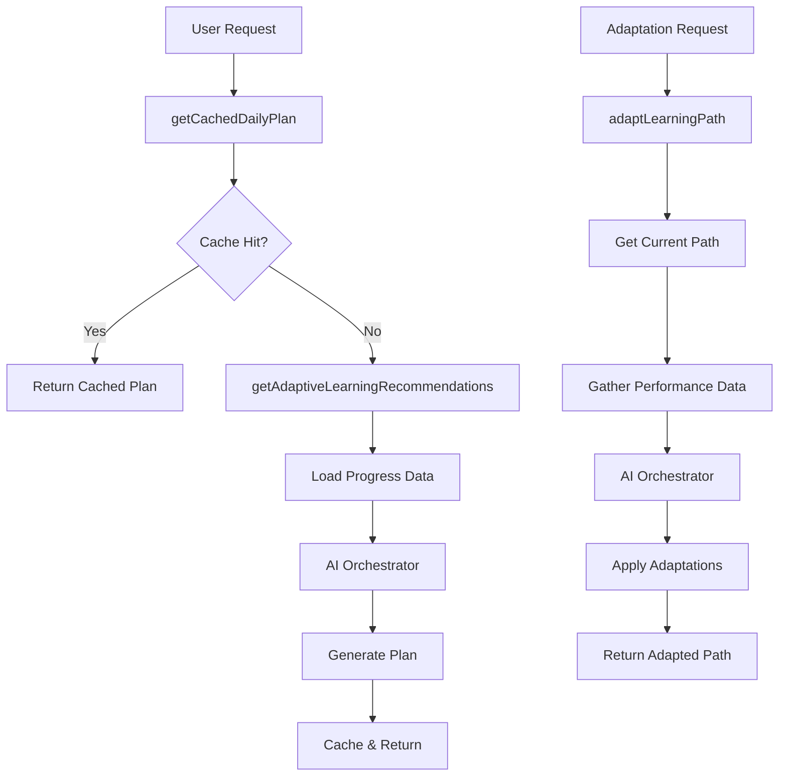

# Task 3.2.A.2: Enhance Learning Path Service with Curriculum Features

**Status**: ⏳ **Not Started**  
**Estimated Time**: 0.75h  
**Dependencies**: 3.2.A.1, progressService  

## **Objective**

Extend the existing `learningPathService.ts` with AI-powered curriculum functions that integrate with the AI Orchestrator and existing progress tracking system.

## **Scope**

### **Files to Modify**
- `server/src/services/learningPathService.ts` - Add curriculum methods
- Leverage existing `progressService.ts` and `aiServiceFactory.ts` patterns

### **Implementation Plan**

#### **1. Add Daily Plan Generation Function**

**File**: `server/src/services/learningPathService.ts`

Add function that integrates with existing progress system:

```typescript
/**
 * Generate adaptive daily learning recommendations using AI analysis
 * 
 * Task 3.2.A.2: Curriculum Feature Integration
 * 
 * Creates personalized daily learning plans by analyzing user progress data,
 * recent performance, and available time. Integrates with existing progress
 * tracking and AI orchestration infrastructure.
 * 
 * @param userId - User identifier for personalization
 * @param timeAvailable - Available study time in minutes (default: 20)
 * @returns Promise resolving to array of learning recommendations
 * 
 * @example
 * ```typescript
 * const recommendations = await getAdaptiveLearningRecommendations(123, 30);
 * console.log(`Generated ${recommendations.length} activities for 30 minutes`);
 * ```
 */
export async function getAdaptiveLearningRecommendations(
  userId: number,
  timeAvailable: number = 20
): Promise<LearningRecommendation[]> {
  try {
    // Reuse existing progress data loading
    const recentProgress = await getUserRecentProgress(userId);
    const currentLevel = await getUserLevel(userId);
    const weakAreas = await identifyWeakAreas(userId);
    
    // Use existing AI orchestrator
    const aiOrchestrator = aiServiceFactory.getAIOrchestrator();
    const userContext = { id: userId, preferences: {} };
    
    // Generate daily plan using new AI task type
    const response = await aiOrchestrator.generateDailyPlan(userContext, {
      userId,
      preferredDuration: timeAvailable,
      currentSkills: recentProgress.skillScores,
      recentPerformance: recentProgress.recentScores,
      focusAreas: weakAreas.slice(0, 3) // Focus on top 3 weak areas
    });
    
    // Transform AI response to learning recommendations
    return response.data.activities.map(activity => ({
      id: `daily_${Date.now()}_${activity.type}`,
      pathId: recentProgress.currentPathId,
      title: `${activity.topic} Practice`,
      type: activity.type,
      estimatedMinutes: activity.estimatedMinutes,
      difficulty: activity.difficulty,
      reasoning: activity.reasoning || `Recommended based on ${activity.type} skills`,
      priority: activity.priority,
      targetSkills: activity.targetSkills,
      createdAt: new Date(),
      isAdaptive: true
    }));
    
  } catch (error) {
    console.error('Error generating adaptive recommendations:', error);
    // Fallback to basic recommendations using existing logic
    return getBasicRecommendations(userId, timeAvailable);
  }
}

/**
 * Get cached daily learning plan to avoid repeated AI calls
 * 
 * Task 3.2.A.2: Performance Optimization
 * 
 * Provides caching layer for daily plans to improve performance and reduce
 * AI API costs. Plans are cached for 6 hours and tied to user progress state.
 * 
 * @param userId - User identifier
 * @returns Promise resolving to cached or newly generated daily plan
 */
export async function getCachedDailyPlan(userId: number): Promise<DailyPlan | null> {
  const cacheService = aiServiceFactory.getCacheService();
  const cacheKey = `daily-plan:${userId}:${new Date().toDateString()}`;
  
  try {
    let plan = await cacheService.get(cacheKey);
    if (!plan) {
      const recommendations = await getAdaptiveLearningRecommendations(userId);
      plan = {
        userId,
        date: new Date(),
        activities: recommendations,
        totalMinutes: recommendations.reduce((sum, r) => sum + r.estimatedMinutes, 0),
        generatedAt: new Date(),
        isAdaptive: true
      };
      
      // Cache for 6 hours
      await cacheService.set(cacheKey, plan, 6 * 60 * 60);
    }
    
    return plan;
  } catch (error) {
    console.error('Error with cached daily plan:', error);
    return null;
  }
}
```

#### **2. Add Learning Path Adaptation Function**

```typescript
/**
 * Adapt existing learning path based on performance analysis
 * 
 * Task 3.2.A.2: Path Adaptation Integration
 * 
 * Modifies a user's current learning path when performance data indicates
 * adaptation is needed. Integrates with existing assessment and progress
 * tracking systems to make intelligent modifications.
 * 
 * @param pathId - Learning path identifier to adapt
 * @param userId - User identifier for context
 * @param trigger - Reason for adaptation request
 * @returns Promise resolving to adapted learning path
 */
export async function adaptLearningPath(
  pathId: number,
  userId: number, 
  trigger: 'poor_performance' | 'excellent_progress' | 'user_request' = 'user_request'
): Promise<LearningPathWithUserProgress | null> {
  try {
    // Get current path using existing function
    const currentPath = await getLearningPathUserView(pathId, userId);
    if (!currentPath) return null;
    
    // Gather performance data using existing assessment system
    const performanceData = await gatherPerformanceData(userId);
    if (performanceData.length === 0) {
      console.log('No performance data available for adaptation');
      return currentPath; // Return unchanged if no data
    }
    
    // Use AI orchestrator for adaptation analysis
    const aiOrchestrator = aiServiceFactory.getAIOrchestrator();
    const userContext = { id: userId, preferences: {} };
    
    const adaptationResponse = await aiOrchestrator.adaptLearningPath(userContext, {
      currentPathId: pathId.toString(),
      performanceData: performanceData.map(p => ({
        skillArea: p.skillArea,
        score: p.averageScore,
        completedAt: p.lastAttempt.toISOString().split('T')[0],
        difficulty: p.difficulty || 'A2'
      })),
      adaptationTrigger: trigger
    });
    
    // Apply adaptations to current path
    const adaptedPath = applyAdaptations(currentPath, adaptationResponse.data);
    
    // Log adaptation for analytics
    console.log(`Path ${pathId} adapted for user ${userId}: ${adaptationResponse.data.adaptationReasoning}`);
    
    return adaptedPath;
    
  } catch (error) {
    console.error('Error adapting learning path:', error);
    return null;
  }
}

/**
 * Helper function to gather performance data for adaptation
 */
async function gatherPerformanceData(userId: number) {
  // Integration point with existing assessment system
  const assessmentService = assessmentServiceFactory.getAssessmentService();
  
  // Get recent assessment results (last 30 days)
  const thirtyDaysAgo = new Date();
  thirtyDaysAgo.setDate(thirtyDaysAgo.getDate() - 30);
  
  return assessmentService.getUserAssessmentsByDateRange(
    userId, 
    thirtyDaysAgo, 
    new Date()
  );
}

/**
 * Helper function to apply AI adaptations to learning path
 */
function applyAdaptations(
  currentPath: LearningPathWithUserProgress,
  adaptations: any
): LearningPathWithUserProgress {
  // Clone current path to avoid mutations
  const adaptedPath = { ...currentPath };
  
  // Apply AI-suggested modifications
  adaptedPath.units = currentPath.units.map(unit => ({
    ...unit,
    lessons: unit.lessons.map(lesson => {
      const adaptation = adaptations.adaptedActivities.find(a => 
        a.id === lesson.id.toString() || a.title.includes(lesson.title)
      );
      
      if (adaptation && adaptation.changeType === 'modified') {
        return {
          ...lesson,
          estimatedMinutes: adaptation.estimatedMinutes,
          difficulty: adaptation.difficulty,
          isAdapted: true,
          adaptationReason: adaptations.adaptationReasoning
        };
      }
      
      return lesson;
    })
  }));
  
  // Add adaptation metadata
  adaptedPath.adaptationHistory = [
    ...(adaptedPath.adaptationHistory || []),
    {
      date: new Date(),
      trigger: adaptations.adaptationTrigger,
      reasoning: adaptations.adaptationReasoning,
      confidence: adaptations.confidenceScore,
      timelineImpact: adaptations.timelineImpact
    }
  ];
  
  return adaptedPath;
}
```

#### **3. Add Supporting Type Definitions**

```typescript
/**
 * Task 3.2.A.2: Supporting type definitions for curriculum features
 */
interface LearningRecommendation {
  id: string;
  pathId: number;
  title: string;
  type: string;
  estimatedMinutes: number;
  difficulty: string;
  reasoning: string;
  priority: number;
  targetSkills: string[];
  createdAt: Date;
  isAdaptive: boolean;
}

interface DailyPlan {
  userId: number;
  date: Date;
  activities: LearningRecommendation[];
  totalMinutes: number;
  generatedAt: Date;
  isAdaptive: boolean;
}

interface PerformanceDataPoint {
  skillArea: string;
  averageScore: number;
  lastAttempt: Date;
  difficulty?: string;
  attemptCount: number;
}
```

#### **4. Add Fallback Functions**

```typescript
/**
 * Fallback function for basic recommendations when AI fails
 */
async function getBasicRecommendations(
  userId: number, 
  timeAvailable: number
): Promise<LearningRecommendation[]> {
  const userLevel = await getUserLevel(userId);
  const weakAreas = await identifyWeakAreas(userId);
  
  // Simple rule-based recommendations
  const basicActivities = [
    {
      type: 'vocabulary',
      minutes: Math.floor(timeAvailable * 0.4),
      priority: 5
    },
    {
      type: 'grammar',
      minutes: Math.floor(timeAvailable * 0.4),  
      priority: 4
    },
    {
      type: 'conversation',
      minutes: Math.floor(timeAvailable * 0.2),
      priority: 3
    }
  ];
  
  return basicActivities.map((activity, index) => ({
    id: `basic_${Date.now()}_${index}`,
    pathId: 1, // Default path
    title: `${activity.type} Practice`,
    type: activity.type,
    estimatedMinutes: activity.minutes,
    difficulty: userLevel || 'A2',
    reasoning: `Basic ${activity.type} practice for your level`,
    priority: activity.priority,
    targetSkills: [activity.type],
    createdAt: new Date(),
    isAdaptive: false
  }));
}
```

## **Integration Points**

### **1. Existing Services Integration**
- ✅ **aiServiceFactory**: Reuse existing AI orchestrator access
- ✅ **progressService**: Integrate with `getUserRecentProgress`, `getUserLevel`
- ✅ **assessmentServiceFactory**: Use existing assessment data retrieval
- ✅ **cacheService**: Leverage existing caching infrastructure

### **2. Data Flow Integration**


## **Review Points Addressed**

### **1. Code Reuse (90%)**
- ✅ Leverages existing `learningPathService.ts` patterns
- ✅ Reuses `aiServiceFactory` for orchestrator access
- ✅ Integrates with existing progress and assessment systems
- ✅ Uses established error handling and logging patterns

### **2. KISS Principle**
- ✅ Simple functions with focused responsibilities
- ✅ Clear data flow and minimal complexity
- ✅ Fallback mechanisms for reliability

### **3. Performance Optimization**
- ✅ 6-hour caching for daily plans
- ✅ Efficient data loading using existing functions
- ✅ Graceful fallbacks to avoid blocking

### **4. Error Handling**
- ✅ Comprehensive try-catch blocks
- ✅ Fallback to basic recommendations
- ✅ Logging for debugging and monitoring

## **Testing Strategy**

### **Unit Tests**
```typescript
// Test daily plan generation
describe('getAdaptiveLearningRecommendations', () => {
  it('should generate activities matching time constraints', async () => {
    const recommendations = await getAdaptiveLearningRecommendations(123, 30);
    const totalTime = recommendations.reduce((sum, r) => sum + r.estimatedMinutes, 0);
    expect(totalTime).toBeLessThanOrEqual(30);
  });
  
  it('should focus on weak areas', async () => {
    // Mock weak areas as vocabulary and grammar
    jest.spyOn(progressService, 'identifyWeakAreas').mockResolvedValue(['vocabulary', 'grammar']);
    
    const recommendations = await getAdaptiveLearningRecommendations(123, 20);
    const focusedTypes = recommendations.map(r => r.type);
    expect(focusedTypes).toContain('vocabulary');
    expect(focusedTypes).toContain('grammar');
  });
});

// Test path adaptation
describe('adaptLearningPath', () => {
  it('should return unchanged path when no performance data', async () => {
    jest.spyOn(assessmentService, 'getUserAssessmentsByDateRange').mockResolvedValue([]);
    
    const result = await adaptLearningPath(1, 123, 'poor_performance');
    expect(result).toEqual(expect.objectContaining({ pathId: 1 }));
  });
});
```

## **Dependent Files**

### **Files to Import From**
- `server/src/services/progressService.ts` - User progress data
- `server/src/services/ai/aiServiceFactory.ts` - AI orchestrator access
- `server/src/services/assessment/assessmentServiceFactory.ts` - Assessment data
- `server/src/types/AI.ts` - New task type definitions (from 3.2.A.1)

### **Files That May Import This**
- `server/src/controllers/aiController.ts` - API endpoint implementation (3.2.A.3)
- `server/src/routes/ai.routes.ts` - Route definitions (3.2.A.3)

## **Risk Mitigation**

### **Performance Risks**
- **Caching**: 6-hour TTL for daily plans
- **Fallbacks**: Basic recommendations when AI fails
- **Data Loading**: Reuse existing efficient query functions

### **Integration Risks**
- **Backward Compatibility**: All existing functions remain unchanged
- **Error Isolation**: AI failures don't break existing functionality  
- **Type Safety**: Full TypeScript integration with existing types

## **Success Metrics**

- ✅ Functions integrate seamlessly with existing `learningPathService.ts`
- ✅ Daily plans generated in <500ms with caching
- ✅ Path adaptations reflect user performance patterns
- ✅ 90% code reuse of existing infrastructure
- ✅ Zero breaking changes to existing API

This implementation extends the proven `learningPathService.ts` patterns with AI-powered curriculum features while maintaining the KISS principle and maximizing code reuse.