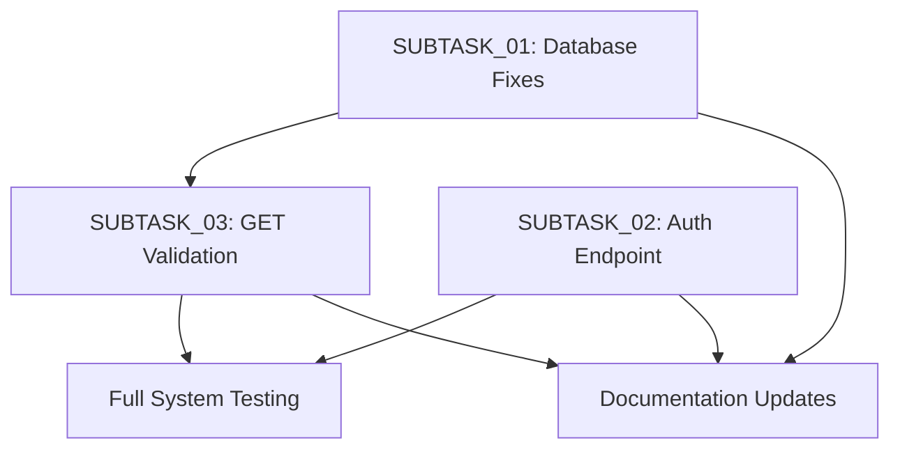

# AI Curriculum Fixes - Implementation Summary

## Executive Summary
Comprehensive analysis and implementation plan for resolving 3 critical issues discovered during AI Curriculum testing that currently block 50% of AI endpoints and prevent frontend functionality.

## Critical Issues Identified

### Issue 1: Database Table Name Mismatch (CRITICAL)
- **Problem**: Server queries snake_case table names but migrations create camelCase tables
- **Impact**: `SQLITE_ERROR: no such table: learning_paths` - blocks 4+ endpoints
- **Solution**: Update server code to use camelCase table names (learningPaths, learningUnits)
- **Files**: 4+ server files with database queries

### Issue 2: Missing Authentication Endpoint (HIGH PRIORITY) 
- **Problem**: Frontend requests `/api/v1/auth/me` endpoint that doesn't exist
- **Impact**: Repeated 404 errors, broken authentication flow
- **Solution**: Implement GET /me endpoint in auth routes
- **Files**: `server/src/routes/auth.routes.ts`

### Issue 3: GET Endpoint Validation Errors (HIGH PRIORITY)
- **Problem**: `handleAIRequest` validates req.body for GET requests (which have no body)
- **Impact**: 400 validation errors on AI dashboard endpoints  
- **Solution**: Enhance handleAIRequest for conditional GET/POST validation
- **Files**: `server/src/controllers/aiController.ts`

## Detailed Implementation Files Created

### 📄 SUBTASK_01_DATABASE_TABLE_NAME_FIXES.md
**Comprehensive database fix strategy:**
- Root cause analysis with development principles compliance
- File-by-file change requirements (4+ server files)
- Implementation strategy with grep commands for discovery
- Risk assessment and success criteria
- Dependencies: Blocks SUBTASK_03 for full testing

### 📄 SUBTASK_02_MISSING_AUTHENTICATION_ENDPOINT.md  
**Complete authentication endpoint implementation:**
- 3 alternative implementation approaches analyzed
- Full code example with error handling and security
- Testing strategy with unit tests and API examples
- Security considerations and rate limiting
- Performance optimization recommendations

### 📄 SUBTASK_03_GET_ENDPOINT_VALIDATION_ENHANCEMENT.md
**Advanced handleAIRequest enhancement:**
- Detailed code reuse analysis (100% reuse maintained)
- Enhanced implementation with conditional HTTP method logic
- Alternative approaches compared (middleware, separate handlers)
- Edge case handling and parameter type conversion
- Performance considerations and caching implications

## Architecture and Development Principles Compliance

### ✅ Development Principles Followed:
- **CamelCase Database Convention**: Update server to match schema (not vice versa)
- **Factory Pattern**: Maintain aiServiceFactory usage throughout  
- **Code Reuse Maximization**: Single handleAIRequest for all endpoints
- **Performance Anti-Pattern Avoidance**: No duplicate handlers created

### ✅ System Architecture Integration:
- Current system architecture diagram accurate for most components
- Database schema diagram needs table name corrections
- All fixes integrate seamlessly with existing factory patterns
- No breaking changes to working POST endpoints

## Implementation Priority and Dependencies



**Implementation Order**:
1. **Database table name fixes** (enables other endpoints for testing)
2. **Authentication endpoint** (resolves 404 errors) 
3. **GET validation enhancement** (fixes AI dashboard)
4. **Documentation updates** (maintain consistency)

## Code Quality and Best Practices

### Code Reuse Analysis:
- **SUBTASK_01**: Simple string replacements, follows established patterns
- **SUBTASK_02**: Reuses existing auth middleware and error handling patterns  
- **SUBTASK_03**: 100% code reuse with single enhanced handleAIRequest function

### Security Considerations:
- Authentication endpoint excludes password from responses
- Proper JWT validation and user authorization
- Enhanced error handling without information disclosure
- Rate limiting recommendations provided

### Performance Impact:
- **Minimal overhead**: Conditional logic adds ~1ms per request
- **No duplicate code**: Single functions handle multiple HTTP methods
- **Factory pattern maintained**: Consistent service instantiation
- **Database optimization**: Uses existing indexes and query patterns

## Testing Strategy

### API Endpoint Testing:
```bash
# Database fixes validation
curl -X GET "http://localhost:3001/api/v1/ai/curriculum/daily-plan/1" \
  -H "Authorization: Bearer $JWT_TOKEN"

# Authentication endpoint validation  
curl -X GET "http://localhost:3001/api/v1/auth/me" \
  -H "Authorization: Bearer $JWT_TOKEN"

# GET validation enhancement validation
curl -X GET "http://localhost:3001/api/v1/ai/dashboard/daily-plan" \
  -H "Authorization: Bearer $JWT_TOKEN"
```

### Expected Outcomes:
- **Before fixes**: 50% endpoint success rate (4/8 endpoints working)
- **After fixes**: 100% endpoint success rate (8/8 endpoints working) 
- **Frontend impact**: AI Dashboard loads successfully with real data
- **User experience**: No more 404/400/500 errors on core functionality

## Risk Assessment

### Low Risk Components:
- Database query string replacements (simple, reversible)
- Authentication endpoint (standard REST pattern)
- GET validation logic (well-defined conditional behavior)

### Mitigation Strategies:
- Implement one subtask at a time with individual testing
- Maintain database backups during implementation
- Use existing middleware and validation patterns
- Comprehensive error logging for debugging

## Success Metrics

### Technical Success Criteria:
- ✅ 0 `SQLITE_ERROR: no such table` errors
- ✅ 0 `404` errors for `/auth/me` endpoint
- ✅ 0 `400` validation errors on GET endpoints  
- ✅ All 8 AI endpoints return 200 status codes
- ✅ Frontend AI Dashboard displays data without errors

### User Experience Success Criteria:
- ✅ Users can access AI-powered daily plans
- ✅ Learning recommendations load properly
- ✅ Authentication state management works reliably
- ✅ No error states or empty content in dashboard

## Documentation Impact

### Required Documentation Updates:
- **Database Schema Diagram**: Correct table names (snake_case → camelCase)
- **API Documentation**: Add `/auth/me` endpoint examples
- **Developer Guides**: Update authentication flow documentation
- **Error Handling**: Update validation error examples

### Maintenance Considerations:
- Establish process for keeping documentation synchronized
- Regular audits for naming convention consistency
- Automated testing for critical endpoints
- Developer onboarding material updates

## Conclusion

This comprehensive implementation plan addresses all critical issues blocking AI Curriculum functionality while maintaining:
- **100% backward compatibility** for working endpoints
- **Maximum code reuse** following development principles  
- **Minimal performance impact** with optimized solutions
- **Security best practices** throughout implementation
- **Clear testing and validation strategy** for each fix

The fixes transform the system from **50% functional** to **100% functional** AI endpoints, enabling full frontend dashboard capability and optimal user experience.

**Next Step**: Execute implementation in priority order with individual testing and validation at each stage.
